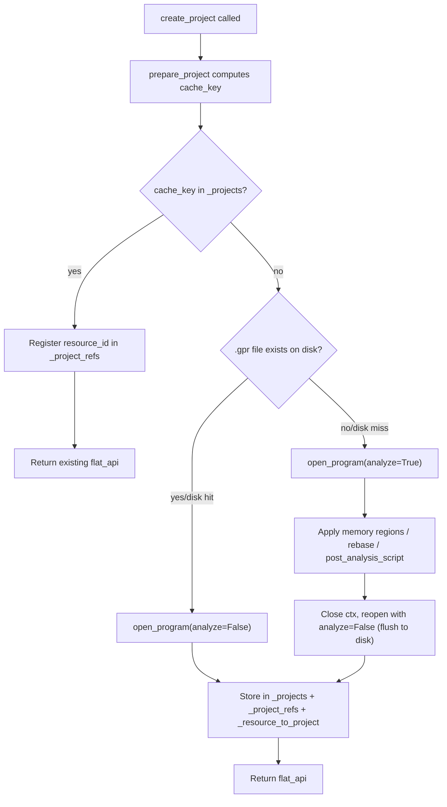
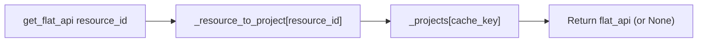
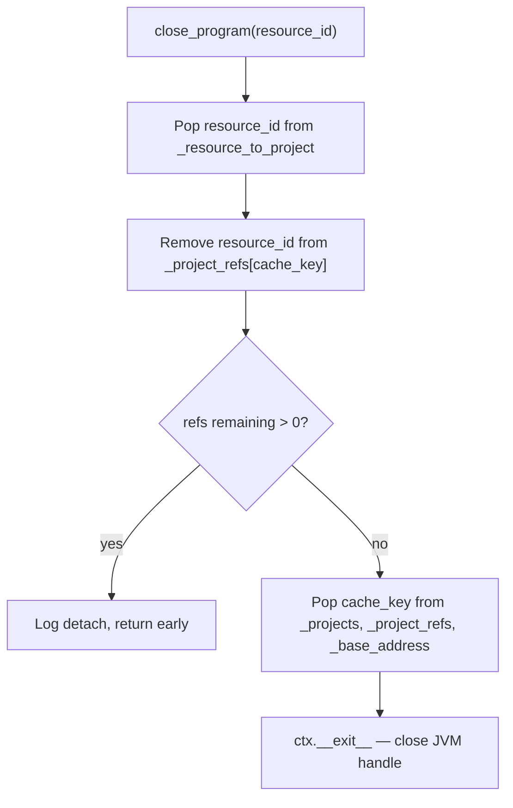
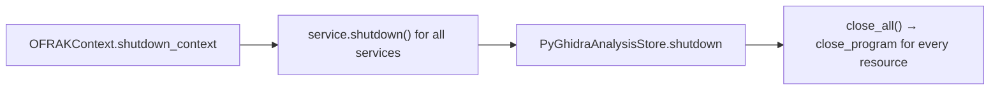
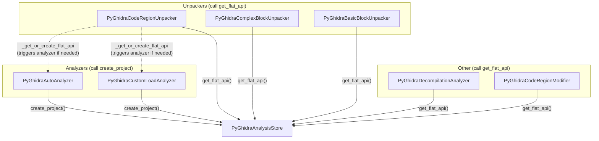
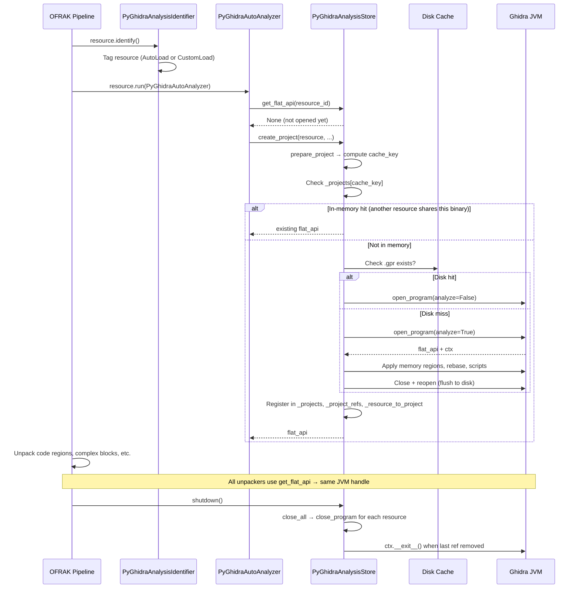

# PyGhidra Components — Caching & Project Lifecycle

## Overview

Opening a Ghidra project is expensive (tens of seconds for a cold start, several seconds
even when reusing an on-disk cache). Two caching layers exist to avoid redundant work:

1. **Disk cache** — Ghidra `.gpr` projects are persisted to `~/.cache/ofrak-pyghidra/`
   (override with `OFRAK_PYGHIDRA_CACHE_DIR`). If the binary hasn't changed, the
   already-analyzed project is reloaded from disk without re-running Ghidra's analysis
   passes.

2. **In-memory handle cache** — `PyGhidraAnalysisStore` keeps open `(flat_api, ctx)`
   handles so that multiple OFRAK components (unpackers, analyzers, decompiler) and
   multiple OFRAK resources that resolve to the same binary can share a single live JVM
   process without reopening.

---

## The Cache Key

Everything pivots on a single string: the **cache_key**, computed in
`pyghidra_analysis.py → _compute_cache_key()`.  It is an MD5 hex-digest of:

```
binary_data || language || base_address || sorted(memory_regions)
```

Two resources that produce the same cache_key are guaranteed to need the same Ghidra
project, so they can share a single open handle.

---

## Data Structures (PyGhidraAnalysisStore)

```
_projects            Dict[cache_key, (flat_api, ctx)]
                     One entry per open Ghidra JVM context.

_project_refs        Dict[cache_key, Set[resource_id]]
                     Which OFRAK resources are currently using each project.
                     Acts as a reference count.

_resource_to_project Dict[resource_id, cache_key]
                     Reverse index: given a resource, find its project.

_base_address        Dict[cache_key, int]
                     Ghidra's image base for PIE binaries, shared across all
                     resources on the same project.
```

Relationships:

```
resource_id_A ──┐
                ├──► cache_key_1 ──► (flat_api, ctx)  [one JVM handle]
resource_id_B ──┘

resource_id_C ─────► cache_key_2 ──► (flat_api, ctx)  [different JVM handle]
```

---

## Flows

### create_project

Called by the analyzers (`PyGhidraAutoAnalyzer`, `PyGhidraCustomLoadAnalyzer`) the
first time a resource needs Ghidra.



### get_flat_api

Called by every component that needs the Ghidra handle for a resource.



### close_program (ref-counted teardown)

Called per-resource.  The JVM context is only actually closed when the last resource
detaches.



### Shutdown



---

## Analyzer Guard

The analyzers **short-circuit** if the store already has a handle for the resource:

```python
# In PyGhidraAutoAnalyzer.analyze / PyGhidraCustomLoadAnalyzer.analyze:
if not self.analysis_store.get_flat_api(resource.get_id()):
    # ... open project ...
```

This means under normal OFRAK component dispatch, `create_project` is called at most
once per resource_id. The sharing across different resource_ids happens inside
`create_project` itself via the cache_key lookup.

---

## Component → Store Dependency Graph

Every PyGhidra component receives the singleton `PyGhidraAnalysisStore` via
constructor injection and uses `get_flat_api` to obtain the JVM handle.



`PyGhidraCodeRegionUnpacker` is special: if `get_flat_api` returns `None`, it
triggers the appropriate analyzer via `_get_or_create_flat_api`, which in turn calls
`create_project`.

---

## Disk Cache Layout

```
~/.cache/ofrak-pyghidra/          (or $OFRAK_PYGHIDRA_CACHE_DIR)
├── <cache_key>                   Raw binary written for pyghidra.open_program
└── <cache_key>_ghidra/
    ├── <cache_key>_ghidra.gpr    Ghidra project file (presence = "cached")
    └── <cache_key>_ghidra.rep/   Ghidra project repository
```

The `cached` flag in `prepare_project` is `True` when the `.gpr` file exists. A disk
cache hit skips Ghidra's full auto-analysis but still opens a JVM context to serve
queries.

---

## Locking

`_lock` is a `threading.Lock` that protects the three in-memory dictionaries. It is
held only during dict reads/writes — never across the (slow) Ghidra project
open/close. This is safe because:

- OFRAK's async event loop is single-threaded for component dispatch; concurrent
  `create_project` calls for the same cache_key are not expected.
- The lock exists primarily to guard against `close_program` racing with
  `get_flat_api` from a different thread (e.g., shutdown triggered from a signal
  handler).

---

## Typical Lifecycle (End to End)


