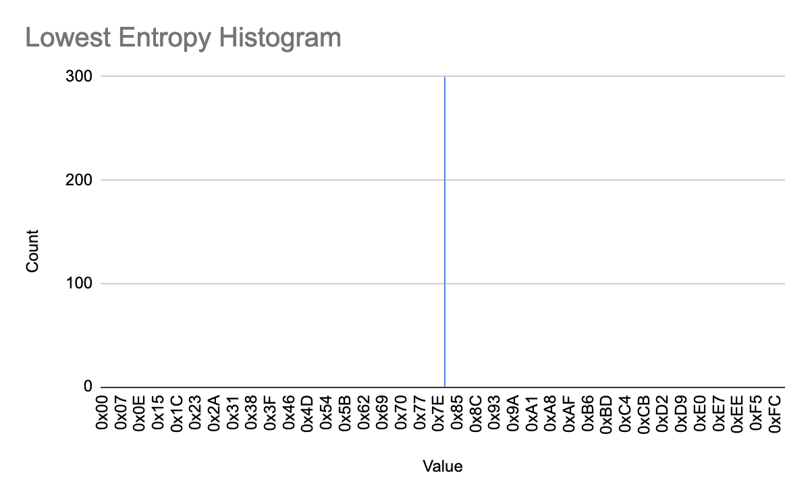

# Minimap View

The “minimap view” (“minimap” for short) on the far right of the GUI (see
figure below) is one way OFRAK helps users. The minimap visually represents all
the data of a selected binary. Each pixel in the minimap corresponds to one
byte of the resource's binary data, with the color of each pixel determined by
the corresponding byte.

The minimap accelerates exploring and navigating to the most important parts of
the binary. Unlike the hex view (directly to the left of the minimap), which
only shows a portion of a resource's binary data at a time, the minimap
provides a bird's eye view of the entire resource. 

Clicking the minimap scrolls the hex view to the corresponding part of the
data. A red box overlaid on the minimap shows what part of the data the hex
view is currently displaying.

## Magnitude View

The default mode of the minimap is "magnitude view" mode. In this simple mode,
each byte of the data is mapped to a grayscale color. Lower byte values create
darker pixels. For example the minimum byte value of `0x00` (0) maps to pure
black, and the maximum byte value of `0xFF` (255) maps to pure white. The
values in between map to corresponding shades of gray.

## Byteclass View

The minimap's "byteclass view" mode is very similar to the magnitude view. Like
the magnitude view, the color of each pixel is based on the value of its
corresponding byte. Unlike the magnitude view, byte values are grouped into
discrete buckets called "byteclasses."

Byteclass mode is most useful for quickly finding strings by looking for yellow
regions of the data with values in the ASCII range. Both magnitude mode and
byteclass mode are also handy for identifying padding regions, headers, and
data (such as symbols) that are aligned at regular intervals.

## Entropy View 

The minimap's "entropy view" mode displays regions with highly random data
across the binary. This is particularly useful for finding compressed and
encrypted data ranges.

[Shannon entropy](https://en.wikipedia.org/wiki/Entropy_(information_theory)),
named for Claude Shannon, is a fundamental concept from information theory that
is used to characterize how random and unpredictable the information in a
sample of bytes is. Intuitively, the Shannon entropy of a probability
distribution quantifies how close that distribution is to uniformly random. In
concrete terms, if you make a histogram of the byte occurrences in a range of
data, the entropy of that histogram is a measure of how flat the bars are. For
example:

- The bars in this histogram are very flat since each byte is approximately
  equally likely to occur. Thus, this data has high entropy -- the bytes are
  very random.

  

- The bars in this histogram show that some bytes are much more likely to occur
  than others. Even though every byte value has some chance of occurring, the
  values at the middle of the range are more likely, and more predictable.
  Thus, this data range is less random, and therefore lower entropy, than the
  first.

  

- There is only one bar in this histogram -- this range of data consists
  entirely of one repeating byte value. Thus, this data is entirely
  predictable, and has the lowest possible entropy value: 0.

  

Since Shannon entropy gives concrete, numerical bounds on how random or
predictable a sample of data can be, it becomes possible to calculate and
visualize the relative levels of randomness between regions of data. Simply
compute a byte occurrence histogram across a region, then calculate the entropy
of the distribution and compare. The entropy view in the OFRAK GUI does exactly
this.

Specifically, in OFRAK, entropy is calculated over a 256-byte sliding window
that moves forward by one byte for each pixel in the minimap. The calculated
entropies are mapped to values between `0x00` and `0xFF` with higher entropy
corresponding to lighter gray pixels and lower entropy corresponding to darker
gray pixels, as in the magnitude mode.

Since compressed and encrypted data generally have high entropy, this minimap
view makes it easy to find and navigate to such data.

