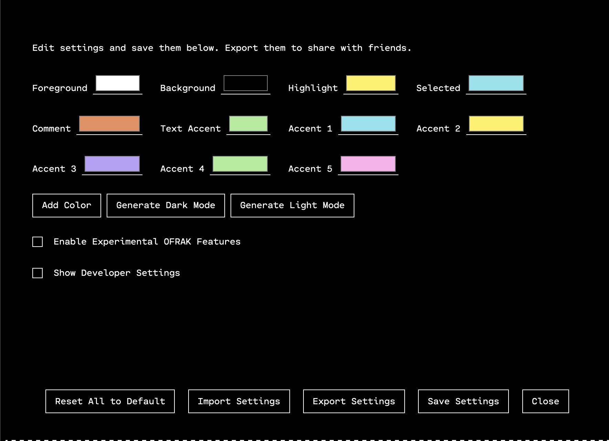

# Settings View

The settings view allows an OFRAK user to configure several aspects of the GUI.
These settings can then be saved in the user's browser, or they can be exported
to a file so that they can be shared with other OFRAK users.

## Change Colors

One of the main uses of the settings panel is to configure the theme of the
OFRAK GUI. From the settings, it is possible to change the text and background
colors, as well as the accent colors. The acent colors are used both for
classes in the byteclass view and for highlighting mapped child regions in the
hex view.

Besides being able to manually change all of the colors in the settings pane,
it is also possible to use auto-generated themes made by AI. The AI-generated
themes come from [Huemint](https://huemint.com/about/), a nifty tool for
developing color palettes. The palette engine was trained on a large corpus of
professional grpahic design images, and can produce some pretty nice-looking
results that don't usually need much tweaking. 

## Other Settings

The settings panel also contains the ability to enable "experimental" OFRAK
features. These are features that are under development, which may therefore
not work as reliably as the rest of the features. 

Finally, the settings pane allows configuring developer settings. These are not
of interest to most OFRAK users, but make developing new GUI features
considerably easier.

## Saving and Exporting

Once a user is happy with their settings, they must save them before closing
the settings pane. Saved settings can be exported, which will download a
`.json` file to the user's computer. That file can be shared with other OFRAK
users. If you find a theme you really like, feel free to share it! 
